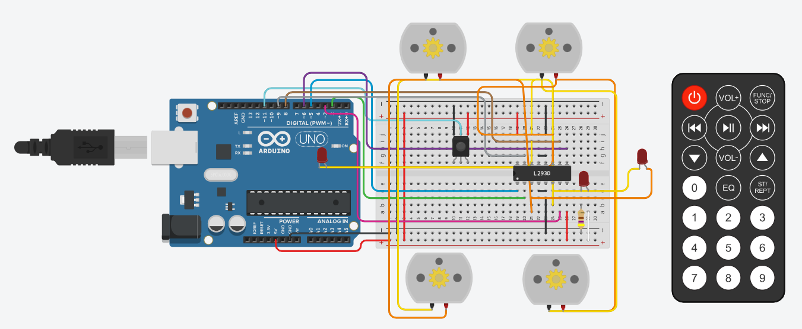

# IR RC Arduino Robot

The IR RC Arduino Robot is a remote-controlled robot that can be controlled using an IR (Infrared) remote. This project utilizes an Arduino Uno programmed with C++ to create a robot that responds to IR remote commands, allowing you to control its movement and direction effortlessly.

## Features

- Remote control: Control the robot's movement and direction using an IR remote.
- Easy setup: Place the robot on a flat surface, power it on, and use the IR remote to start controlling its motion.
- Interactive design: The robot responds to various IR remote buttons, enabling you to make it move forward, backward, left, and right.

## Technology Stack

- Arduino Uno
- C++ Programming Language

## Usage

1. **Hardware Setup**: Assemble the hardware components according to the circuit design. Refer to the circuit image provided as "ir_rc_robot.png" for guidance. Make sure to connect all the components correctly.

2. **Upload Code**: Upload the C++ code provided in the "Code" folder onto your Arduino Uno using the Arduino IDE.

3. **Power On**: Place the robot on a flat surface and power it on using a suitable power source.

4. **Control with IR Remote**: Use the IR remote to control the robot's movement. Press the corresponding buttons on the remote to make the robot move in different directions:
   - Press "Volume up" button to move the robot forward.
   - Press "Volume down" button to move the robot backward.
   - Press "Backward track" button to make the robot turn left.
   - Press "Forward track" button to make the robot turn right.

## Circuit

The circuit diagram is depicted above. Refer to this diagram while assembling the components to ensure proper connections.

## Credits

This project was designed and implemented by D.Shiv Harsha Vignesh. For any questions or inquiries, you can contact me at shivharsha03@gmail.com.

